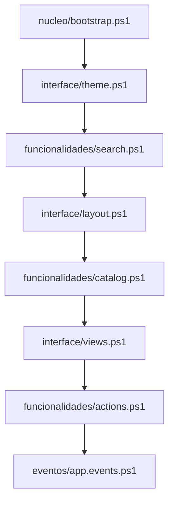

# Arquitetura

Este documento descreve a arquitetura atual do BananaSuisa em PowerShell + WinForms, a relacao entre modulos e a ponte para a futura migracao .NET.

## Visao geral

Hoje o projeto tem duas formas principais:

- **fonte modular:** `BananaSuisa_desenvolvimento/`
- **artefato consolidado:** `BananaSuisa.ps1`

A edicao deve acontecer sempre na base modular. O consolidado existe para execucao e distribuicao do estado atual.

## Fluxo de carga

Versao unica em `nucleo/versao.ps1` (`$script:BananaSuisaVersao`).

O carregamento efetivo e definido por `ferramentas/Gerar_BananaSuisa.ps1`:

## Modulos e responsabilidades

| Modulo | Papel principal |
|--------|-----------------|
| `nucleo/bootstrap.ps1` | Requisitos, paths, workspace, config, memoria, logs, deteccao de `winget`, pre-requisitos do Windows e utilitarios base. |
| `nucleo/versao.ps1` | Fonte unica da versao da aplicacao. |
| `interface/theme.ps1` | Form principal, tema, paleta, titulo e comportamento de encerramento. |
| `funcionalidades/search.ps1` | Header, caixa de busca, debounce e fuzzy search. |
| `interface/layout.ps1` | Estrutura visual: sidebar, cabecalho, conteudo, rodape e contexto visual. |
| `funcionalidades/catalog.ps1` | Catalogo, logging na UI, inventory, updates, drivers e acesso a dados auxiliares. |
| `interface/views.ps1` | Modos da aplicacao, orquestracao de fluxos e grande parte da experiencia atual. |
| `funcionalidades/actions.ps1` | Reparos, manutencao de cache e operacoes ligadas ao ecossistema `winget`. |
| `eventos/app.events.ps1` | Ligacao de handlers, botoes e ciclo de vida do formulario. |

## Dependencias de ordem importantes

- `bootstrap.ps1` precisa ser carregado primeiro porque define base de runtime, paths, log e utilitarios transversais.
- `search.ps1` entra antes de `layout.ps1`; esta ordem importa porque partes do layout dependem do header criado pela busca.
- `app.events.ps1` deve ser o ultimo, porque depende dos controles e funcoes ja carregados.

## Dados e persistencia

### Recursos do projeto

- `BananaSuisa_recursos/` guarda templates de JSON, configuracoes base e ficheiros auxiliares.

### Memoria da aplicacao

- `BananaSuisa_recursos\BananaSuisa_memoria\` guarda estado de execucao.
- Subpastas relevantes:
  - `Dados/` para config e catalogos em uso
  - `Registros/` para logs, incluindo `BananaSuisa.json`
  - `PacotesBaixados/` para downloads e caches ligados ao `winget`

## Dependencias externas relevantes

O runtime atual depende de:

- `winget` / `Microsoft.DesktopAppInstaller`
- WinForms e `System.Drawing`
- AppX / `Add-AppxPackage`
- WMI/CIM e servicos do Windows
- downloads HTTP e ficheiros locais
- modulo `Microsoft.WinGet.Client` em partes do fluxo
- modulo `PSWindowsUpdate` em cenarios de update

Isto explica porque a validacao real ainda precisa de Windows, rede e, em varios casos, privilegios elevados.

## Build consolidado

`ferramentas/Gerar_BananaSuisa.ps1` concatena os modulos em `BananaSuisa.ps1` e embute a versao lida de `nucleo/versao.ps1`.

O gerador:

1. resolve a raiz do projeto;
2. carrega a versao unica;
3. percorre os modulos em ordem fixa;
4. remove `#Requires` locais;
5. grava um unico arquivo UTF-8 com regioes `#region`.

## Limites da arquitetura atual

- Forte dependencia de estado global em escopo de script.
- Acoplamento entre UI, operacao e integracao com sistema.
- Grande volume de logica concentrado em `views.ps1` e `catalog.ps1`.
- Dificuldade de testar partes do produto sem abrir a interface ou depender de runtime real.

## Visao pos-migracao

A migracao planeada pretende separar a aplicacao em camadas mais claras:

- **UI .NET** para layout, navegacao e estado visual;
- **servicos** para catalogo, busca, instalacao, update e remocao;
- **infraestrutura** para `winget`, AppX, registo, downloads e sistema operativo;
- **core** para configuracao, versionamento, modelos e contratos.

Documentos de ponte:

- [`../../docs/ROADMAP_MIGRACAO.md`](../../docs/ROADMAP_MIGRACAO.md)
- [`../../docs/MAPEAMENTO_PS1_PARA_DOTNET.md`](../../docs/MAPEAMENTO_PS1_PARA_DOTNET.md)
- [`../../docs/adr/README.md`](../../docs/adr/README.md)
