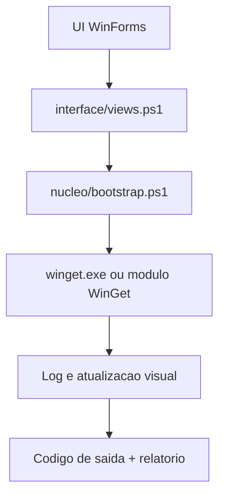

# Fluxo de instalacao

Este documento resume como o BananaSuisa executa instalacao, atualizacao e modos relacionados ao `winget` no estado atual em PowerShell + WinForms.

## Visao geral

O fluxo principal nasce na UI, passa por funcoes de `interface/views.ps1` e depende do bootstrap para localizar `winget`, preparar o ambiente e interpretar resultados.

## Fluxo online de instalacao

1. A UI chama `Install-AppWithWinget` em `interface/views.ps1`.
2. O caminho do executavel e resolvido por `Get-BananaSuisaWingetExe` em `nucleo/bootstrap.ps1`.
3. O processo `winget install` e iniciado com redirecionamento de `stdout` e `stderr`.
4. A interface consome a saida em loop e usa `DoEvents()` para reduzir bloqueio visual.
5. O codigo de saida e comparado com a tabela `$script:WingetErrors`.
6. O resultado e refletido no log, na UI e no relatorio final.

## Fluxo online de atualizacao e remocao

O desenho geral repete a mesma ideia:

- `Update-AppWithWinget` para atualizacao;
- `Remove-AppWithWinget` para remocao;
- helpers do bootstrap para localizar runtime, validar o `winget` e interpretar erros.

O comportamento visual e semelhante ao de instalacao: leitura incremental de saida, manutencao de responsividade e consolidacao do resultado em relatorio.

## Fluxo offline

Quando o fluxo nao depende diretamente de pesquisa remota, o app pode usar instaladores guardados em:

- `BananaSuisa_recursos\BananaSuisa_memoria\PacotesBaixados\`
- subpastas associadas a cache e downloads do `winget`

Isto e usado em cenarios de reaproveitamento de pacotes locais, manutencao de cache e suportes auxiliares.

## Responsabilidades por ficheiro

| Ficheiro | Papel no fluxo |
|----------|----------------|
| `nucleo/bootstrap.ps1` | Deteccao de `winget`, requisitos, workspace, mapeamento de erros e helpers base. |
| `funcionalidades/catalog.ps1` | Pesquisa online, logging e inventario de apps/updates. |
| `interface/views.ps1` | Orquestracao dos modos de instalacao, update, remocao e relatorio. |
| `funcionalidades/actions.ps1` | Reparos, cache e manutencao do ecossistema `winget`. |
| `eventos/app.events.ps1` | Disparo dos fluxos a partir dos botoes e modos da UI. |

## Tratamento de erro

O fluxo atual considera:

- `stdout` e `stderr` vindos do processo;
- codigos de saida conhecidos via `$script:WingetErrors`;
- cenarios de sucesso parcial;
- falhas de runtime, ausencia do `winget` ou problemas ligados ao App Installer.

Documentos relacionados:

- [`../especialistas/winget_exit_codes.md`](../especialistas/winget_exit_codes.md)
- [`../especialistas/uwp_appinstaller.md`](../especialistas/uwp_appinstaller.md)

## Responsividade da UI

O BananaSuisa atual usa leitura em loop com `DoEvents()` para manter a janela responsiva durante operacoes longas.

Isto reduz congelamentos visuais, mas tambem revela um limite da arquitetura atual: parte da operacao pesada continua ligada diretamente ao ciclo de vida da interface.

Documentacao relacionada:

- [`../especialistas/powershell_ui.md`](../especialistas/powershell_ui.md)

## Pontos de atencao

- O fluxo depende de Windows real, `winget`, App Installer e, em varios cenarios, privilegios elevados.
- Operacoes de instalacao e reparo nao devem ser consideradas totalmente validadas apenas por build do script.
- Drivers, updates e reparos de cache podem seguir caminhos paralelos ao `winget install` classico.

## Ponte para a migracao .NET

Na migracao, o objetivo e separar este fluxo em:

- camada de UI;
- servicos de operacao;
- infraestrutura de `winget`, AppX e processo;
- resultados estruturados, em vez de logica acoplada a handlers visuais.

Ver tambem:

- [`../../docs/ROADMAP_MIGRACAO.md`](../../docs/ROADMAP_MIGRACAO.md)
- [`../../docs/MAPEAMENTO_PS1_PARA_DOTNET.md`](../../docs/MAPEAMENTO_PS1_PARA_DOTNET.md)
