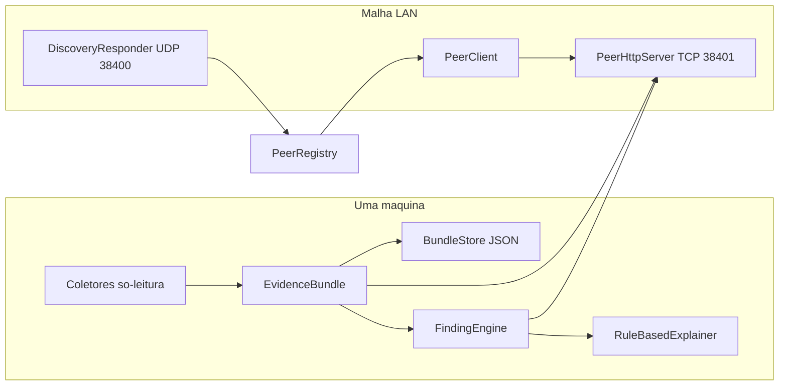

# App Farol

Guia técnico do app `Ribanense.Solucoes.App.Farol`: uma malha de evidências na rede local.
Cada estação vira um **farol** que captura um dossiê estruturado da própria máquina,
enxerga os outros faróis da mesma loja e permite comparar uma máquina com problema contra
uma máquina saudável.

> Estado atual: lógica de coleta, regras, diff, transporte e UI cobertos por testes xUnit.
> A **validação em rede real** (duas ou mais máquinas Windows na mesma LAN, com firewall
> e perfil de rede reais) permanece **pendente** e é obrigatória antes de anunciar a malha
> como homologada.

## O que o Farol faz — e o que ele deliberadamente não faz

O Farol **captura, correlaciona e exporta**. Ele **não corrige**. Nenhum coletor escreve
no sistema, nenhuma regra dispara ação, nenhum script elevado roda sozinho. A única
elevação existente é a criação das regras de firewall, sempre iniciada pelo usuário.

Essa fronteira é o que permite deixá-lo rodando em produção sem medo: no pior caso ele
lê algo que não deveria e registra `Denied` no dossiê.

## Identidade no monorepo

| Campo | Valor |
|-------|-------|
| Projeto | [`src/aplicativos/Ribanense.Solucoes.App.Farol/`](../src/aplicativos/Ribanense.Solucoes.App.Farol/) |
| ID | `com.ribanense.farol` |
| Prefixo de tag | `farol-v` |
| Categoria no catálogo | `Ferramentas` |
| Testes | [`tests/Ribanense.Solucoes.App.Farol.Tests/`](../tests/Ribanense.Solucoes.App.Farol.Tests/) |

## Arquitetura



O orquestrador é `FarolStation`: ele detém coleta, histórico, regras, registro de pares e
os dois servidores. As ViewModels não conhecem rede nem WMI.

## Coletores

Cada captura produz um `EvidenceBundle` versionado (`SchemaVersion`). Um coletor que falha
vira um `CollectorOutcome` com status `Denied`, `Failed` ou `Skipped` e a captura segue —
o Farol nunca morre por causa de um sensor.

| Coletor | Fonte | Observação |
|---------|-------|------------|
| `IdentityCollector` | `Environment`, `RuntimeInformation` | Hostname, usuário, edição do Windows, uptime, fuso. |
| `NetworkCollector` | `NetworkInterface` + `INetworkListManager` (COM) + ping | Adaptadores, DNS, gateway e o **perfil de rede** (Pública/Privada/Domínio). |
| `DiskCollector` | `DriveInfo` | Só volumes fixos e prontos. |
| `ServicesCollector` | `ServiceController` | `Spooler`, `LanmanServer`, `LanmanWorkstation`, `Dnscache`, `Winmgmt`. |
| `PrintersCollector` | WMI `Win32_Printer` | Fila, porta, driver, padrão e `WorkOffline`. |
| `EventLogCollector` | `System.Diagnostics.EventLog` | Application + System, só Erro/Aviso, janela de 2 h, no máximo 25 por log. |
| `RibanenseLogsCollector` | Vaults LiteDB dos apps irmãos | Lê `%LOCALAPPDATA%\Ribanense Soluções\apps\`. |
| `ProcessCollector` | `Process.GetProcesses` | Top 5 por memória. |

O `EventLogCollector` percorre o log do mais recente para trás e para ao cruzar a janela:
varrer o log inteiro em máquina antiga custa segundos. O `RibanenseLogsCollector` abre o
vault de cada app em modo direto; se o app estiver rodando o arquivo está travado, e isso
é registrado como observação em vez de erro.

## Regras (`FindingEngine`)

Determinísticas, sem modelo. Toda conclusão aponta a evidência que a sustenta.

| Regra | Severidade | Gatilho |
|-------|------------|---------|
| `service.spooler.stopped` | Alta | Spooler diferente de `Running`. |
| `service.dnscache.stopped` | Média | Dnscache parado. |
| `service.wmi.stopped` | Média | Winmgmt parado. |
| `disk.critical` / `disk.low` | Alta / Média | Menos de 10% / menos de 20% livres. |
| `network.public-profile` | Alta sem pares, Média com pares | Perfil de rede é Pública. |
| `network.no-gateway` | Alta | Nenhum adaptador ativo declara gateway IPv4. |
| `network.gateway-unreachable` | Alta | Gateway existe mas não responde ping. |
| `network.no-dns` | Alta | Nenhum DNS IPv4 nos adaptadores ativos. |
| `printer.offline` | Alta se padrão, senão Média | Fila offline ou `WorkOffline`. |
| `eventlog.error-burst` | Média | 10 ou mais erros na janela coletada. |
| `ribanense.app-errors` | Baixa | App irmão registrou erro no próprio vault. |
| `collector.incomplete` | Info | Algum sensor devolveu `Denied` ou `Failed`. |

## Malha LAN

### Descoberta — UDP 38400

`DiscoveryResponder` anuncia um `FarolHello` a cada 20 s e escuta os anúncios vizinhos.
O broadcast é **dirigido por adaptador** (endereço de broadcast de cada sub-rede) em vez
de `255.255.255.255`: máquinas com Wi-Fi, cabo e adaptadores virtuais de VPN só entregam
o pacote na sub-rede certa dessa forma. O socket de escuta usa `ReuseAddress` para não
derrubar outra instância na mesma porta.

### API entre pares — TCP 38401

| Rota | Resposta |
|------|----------|
| `GET /health` | `HealthSignal`: nível, contagem de achados, manchete, id do último dossiê. |
| `GET /bundle/latest` | Último `EvidenceBundle` completo (204 se ainda não houve captura). |
| `GET /bundle/{id}` | Dossiê específico do histórico. |

O servidor fala HTTP/1.1 sobre `TcpListener` em vez de usar `HttpListener`. O motivo é
concreto: `HttpListener` exige reserva de URL (`netsh http add urlacl`) ou processo
elevado para escutar fora de `localhost`, e o Farol precisa subir como usuário comum na
inicialização do Windows. Um socket TCP simples não tem essa restrição.

O ciclo automático só puxa `/health`. Baixar dossiê inteiro de todos os pares a cada
ciclo encheria a rede da loja sem necessidade; o dossiê completo só é buscado quando o
usuário aperta **Comparar**.

### Pareamento por código da loja

Na primeira execução o usuário define um **código da loja** (por exemplo `LOJA-RIBA-042`)
em **Ajustes**. Só faróis com o mesmo código trocam dossiês.

O código **nunca trafega em claro**: o beacon UDP carrega apenas `SHA256(sal + código)`,
e o servidor recusa com `403` qualquer requisição cujo cabeçalho `X-Farol-Store` não bata
(comparação em tempo constante). Sem isso, uma rede compartilhada com terceiros viraria
espionagem acidental de inventário.

O código é normalizado antes do hash (maiúsculas, sem espaços), então digitá-lo de forma
levemente diferente em cada máquina não quebra o pareamento.

### Firewall

**Ajustes → Liberar portas no firewall** cria as duas regras de entrada numa única
elevação:

- `Ribanense Farol - Descoberta (UDP)` na 38400
- `Ribanense Farol - API entre pares (TCP)` na 38401

Ambas com `-Profile Domain,Private` e `-RemoteAddress LocalSubnet`. Em rede Pública o
Farol deve continuar mudo, e nada aqui abre porta para fora da sub-rede.

## Ficar acordado: bandeja e autostart

O Farol é o primeiro app do catálogo com **background de verdade** — a malha só existe
enquanto o processo está de pé. O padrão adotado:

- `ShutdownMode = OnExplicitShutdown`. Fechar a janela apenas a esconde; sair é pelo menu
  da bandeja.
- Bandeja via `NotifyIcon` do WinForms (`UseWindowsForms` no `.csproj`, com os usings
  implícitos de WinForms removidos para não colidir `Application` e `UserControl` com o
  WPF).
- Autostart em `HKCU\Software\Microsoft\Windows\CurrentVersion\Run`, com o argumento
  `--tray`. É a opção que **não exige administrador**, some junto com o perfil do usuário
  e aparece no Gerenciador de Tarefas, onde o usuário pode desligar sem depender do app.
- Notificação de balão só para achados de severidade Alta.

## Exportação

**Dossiê → Exportar ZIP** gera `farol-{hostname}-{yyyyMMdd-HHmm}.zip` com:

| Arquivo | Conteúdo |
|---------|----------|
| `bundle.json` | Dossiê completo. |
| `findings.json` | Achados ranqueados. |
| `peers-timeline.json` | Cada par, último sinal, há quanto tempo está calado e a saúde dele. |
| `resumo.txt` | Texto em pt-BR pronto para colar no chamado. |

## CLI

| Comando | Efeito |
|---------|--------|
| `--version` | JSON com versão do app e do SDK. |
| `--selfcheck` | Verifica se as portas 38400/UDP e 38401/TCP estão livres. Porta ocupada é o diagnóstico mais comum de "os faróis não se enxergam". |
| `--logs [n]` | Despeja os últimos `n` registros do vault. |
| `--tray` | Sobe minimizado na bandeja (usado pelo autostart). |

## Encaixe da IA (fase seguinte)

O MVP já expõe `IEvidenceExplainer`:

```csharp
Task<string> ExplainAsync(EvidenceBundle bundle, IReadOnlyList<Finding> findings, CancellationToken ct);
```

A implementação atual é `RuleBasedExplainer`, que monta o texto direto dos achados. Um
`LocalLlmExplainer` pode substituí-la sem tocar em coleta, regras ou transporte. Duas
regras valem para essa fase: o explicador **não pode** virar dependência da captura (se
ele falhar, o dossiê e os achados continuam), e o Farol **não embute pesos de modelo** no
Release nem no git.

## Troubleshooting

| Sintoma | Causa provável | Onde olhar |
|---------|----------------|------------|
| Mapa vazio | Perfil de rede Pública, firewall fechado ou código da loja diferente | Achado `network.public-profile`; **Ajustes → Liberar portas** |
| Mapa vazio só em uma máquina | Porta já em uso | `--selfcheck` |
| Par aparece e some | Máquina hibernando ou Wi-Fi caindo | Card do par mostra "Último sinal antes de sumir" |
| Comparar diz que o par não devolveu dossiê | Aquela máquina nunca capturou | Rodar **Capturar agora** lá |
| Seções faltando no dossiê | Sensor sem permissão | Achado `collector.incomplete` e `--logs` |

## Validação

```bat
.\rb.cmd compilar
.\rb.cmd test
```

Manual, obrigatória antes de release: duas máquinas com o mesmo código de loja → o mapa
mostra ambas; capturar dossiê nas duas; comparar; exportar ZIP; encerrar o Farol numa
delas e confirmar que a outra a marca como **Ausente** e depois **Offline**, preservando
o último sinal de saúde.
