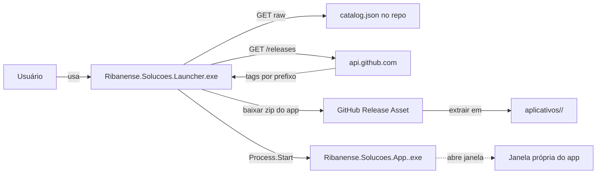

# Arquitetura

**Ribanense Soluções** é um **launcher** + **catálogo de apps modulares**, inspirado no Adobe Creative Cloud. Cada app é um `.exe` WPF independente, distribuído via GitHub Releases, com atualização granular por app e sem servidor proprietário.

## Visão geral



## Componentes

| Componente | Papel | Binário |
|------------|-------|---------|
| `Launcher` | Catálogo, instalador, atualizador, gerenciador de apps. | `Ribanense.Solucoes.Launcher.exe` |
| `PluginSDK` | Contratos entre Launcher e apps (SemVer versionado). | `Ribanense.Solucoes.PluginSDK.dll` |
| `Infrastructure` | LiteDB, logging JSON, IO. | `Ribanense.Solucoes.Infrastructure.dll` |
| `UI` | Estilos, breakpoints, base MVVM, controles reutilizáveis. | `Ribanense.Solucoes.UI.dll` |
| Apps (`aplicativos/<Nome>/`) | Cada módulo publicado no catálogo. | `Ribanense.Solucoes.App.<Nome>.exe` |

## Estrutura em disco no usuário final

```
C:/Program Files/Ribanense Soluções/
  Ribanense.Solucoes.Launcher.exe
  runtime/ *.dll
  Launcher.dat                                 (LiteDB do Launcher)
  aplicativos/                                 (vazio até instalar)
    Winget/
      app.json
      Ribanense.Solucoes.App.Winget.exe
      *.dll
    Uwp/
      ...
```

Dados mutáveis por app:

```
%LOCALAPPDATA%/Ribanense Solucoes/apps/<id>/
  <Nome>.dat                                   (LiteDB do app)
  cache/
  logs/
```

## Fluxo de atualização por app

1. Launcher varre `aplicativos/` para montar a lista de instalados.
2. Para cada instalado: consulta `GET /repos/{owner}/{repo}/releases`, filtra por `tag.startsWith(manifest.githubTagPrefix)`, obtém maior SemVer.
3. Compara com versão local (lida de `app.json`). Se maior, badge "Atualizar".
4. Download do zip, validação SHA256, extração em `<App>.tmp/`, swap atômico de pasta.
5. Se o app está em execução (mutex `Global\Ribanense.<id>`), a atualização é bloqueada com UI clara.

## Garantias de independência

- **Launcher sem apps**: funciona; aba Catálogo mostra todos publicados, Meus Apps vazio.
- **App sem Launcher**: executar o `.exe` diretamente funciona; sem `RIBANENSE_APP_DATA`, usa defaults locais em `%LOCALAPPDATA%`.
- **Nada de dependência de compilação** entre Launcher e apps. Contrato via `app.json` + CLI (`--version`, `--selfcheck`).

## Naming e ortografia

| Onde aparece | Forma |
|--------------|-------|
| UI, manifestos públicos, README, installer | **Ribanense Soluções** (com ç e õ) |
| Namespaces, pastas, tags, IDs, CLI | **Ribanense.Solucoes** (ASCII) |
| Paths runtime (Program Files, LOCALAPPDATA) | "Ribanense Soluções" (tolerado pelo Windows) |

## Documentos relacionados

- [`PLUGIN_SDK.md`](PLUGIN_SDK.md)
- [`RELEASE_PROCESS.md`](RELEASE_PROCESS.md)
- [`../AGENTS.md`](../AGENTS.md)
