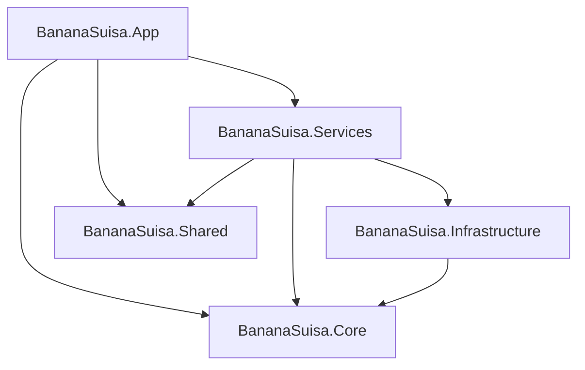

# Mapeamento PS1 para .NET

Este documento traduz a base atual em PowerShell para uma estrutura .NET mais clara, preservando responsabilidade, contexto e dependencias antes de qualquer migracao de codigo.

## Objetivo

Evitar uma reescrita sem mapa. Cada modulo atual deve ter um destino sugerido, com observacoes sobre:

- responsabilidade real hoje;
- dependencias externas;
- grau de acoplamento com UI;
- dificuldade de migracao;
- destino sugerido na solution futura.

## Estrutura .NET sugerida

Esta proposta ainda depende dos ADRs futuros, mas serve como referencia de organizacao:

### Papel sugerido de cada projeto

| Projeto | Papel |
|---------|-------|
| `BananaSuisa.App` | UI desktop, navegacao, estado de tela, comandos e binding. |
| `BananaSuisa.Core` | Modelos, configuracao, regras basicas, versionamento, contratos e helpers sem dependencia de UI. |
| `BananaSuisa.Services` | Casos de uso do produto: catalogo, busca, instalacao, atualizacao, remocao, relatorios e operacoes de negocio. |
| `BananaSuisa.Infrastructure` | Integracoes com `winget`, AppX, ficheiros, rede, registo, WMI/CIM, processos e downloads. |
| `BananaSuisa.Shared` | Tipos transversais simples, resultados, enums, DTOs e utilitarios pequenos. |

## Resumo dos modulos atuais

| Modulo PS1 | Linhas aprox. | Complexidade | Destino principal |
|------------|---------------|--------------|-------------------|
| `nucleo/bootstrap.ps1` | ~1639 | Alta | `Core` + `Infrastructure` |
| `nucleo/versao.ps1` | ~3 | Baixa | `Core` |
| `interface/theme.ps1` | ~78 | Baixa | `App` |
| `interface/layout.ps1` | ~472 | Media | `App` |
| `interface/views.ps1` | ~3355 | Muito alta | `App` + `Services` |
| `funcionalidades/search.ps1` | ~277 | Media | `App` + `Core` |
| `funcionalidades/catalog.ps1` | ~1578 | Alta | `Services` + `Infrastructure` |
| `funcionalidades/actions.ps1` | ~372 | Media | `Services` + `Infrastructure` |
| `eventos/app.events.ps1` | ~577 | Alta | `App` |

## Mapeamento detalhado

### 1. `nucleo/bootstrap.ps1`

- **Linhas:** ~1639
- **Funcoes importantes:** `Get-BananaSuisaProjectRoot`, `Get-BananaSuisaWingetExe`, `Initialize-Workspace`, `Get-AppConfig`, `Load-AppConfig`, `Save-AppConfig`, `Test-WingetInstalled`, `Initialize-WinGetModule`, `Invoke-RegistryUninstall`
- **Responsabilidade atual:** bootstrap da app, requisitos, setup de workspace, memoria local, logs, deteccao de `winget`, pre-requisitos do Windows, configuracao e utilitarios transversais
- **Dependencias principais:** WinForms, AppX, registo, ficheiros, processos, `Microsoft.WinGet.Client`, P/Invoke, servicos do Windows
- **Destino .NET sugerido:**
  - `BananaSuisa.Core/Configuration/`
  - `BananaSuisa.Core/Workspace/`
  - `BananaSuisa.Infrastructure/WinGet/`
  - `BananaSuisa.Infrastructure/Windows/`
  - `BananaSuisa.Infrastructure/Logging/`
- **Notas de migracao:**
  - partir por servico, nao por ficheiro unico;
  - separar diagnostico de runtime de logica de UI;
  - encapsular operacoes de processo, AppX e registo atras de interfaces.

### 2. `nucleo/versao.ps1`

- **Linhas:** ~3
- **Responsabilidade atual:** definir `$script:BananaSuisaVersao`
- **Destino .NET sugerido:**
  - `BananaSuisa.Core/Versioning/AppVersion.cs`
  - ou metadata do assembly / MSBuild
- **Notas de migracao:**
  - manter uma unica fonte de verdade;
  - decidir se a versao sera lida de `Directory.Build.props`, `csproj` ou assembly metadata.

### 3. `interface/theme.ps1`

- **Linhas:** ~78
- **Responsabilidade atual:** paleta de cores, dimensoes, criacao do `Form`, titulo com versao e comportamento de encerramento
- **Dependencias principais:** `System.Windows.Forms`, `System.Drawing`, tema de janela e save de log
- **Destino .NET sugerido:**
  - `BananaSuisa.App/Theme/`
  - `BananaSuisa.App/Shell/`
- **Notas de migracao:**
  - manter esta camada fina;
  - evitar que a nova UI recupere responsabilidades de logica que hoje ja estao espalhadas no legado.

### 4. `interface/layout.ps1`

- **Linhas:** ~472
- **Funcoes importantes:** `Set-ViewContext`
- **Responsabilidade atual:** composicao visual da UI, painis, sidebar, rodape, area de logs, labels e botoes principais
- **Dependencias principais:** controles WinForms e estado visual compartilhado
- **Destino .NET sugerido:**
  - `BananaSuisa.App/Layout/`
  - `BananaSuisa.App/Controls/`
- **Notas de migracao:**
  - transformar composicao manual em layout declarativo;
  - manter a semantica dos modos sem copiar o acoplamento atual com controles globais;
  - observar a dependencia de ordem com `search.ps1`, que cria o header antes de partes do layout.

### 5. `interface/views.ps1`

- **Linhas:** ~3355
- **Funcoes importantes:** `Show-InstallMode`, `Show-UpdateMode`, `Show-RemoveMode`, `Show-SystemMode`, `Show-PrintersMode`, `Install-AppWithWinget`, `Update-AppWithWinget`, `Remove-AppWithWinget`, `Show-Report`, `Update-Layout`
- **Responsabilidade atual:** modos da UI, fluxos operacionais, downloads, impressoras, conta local, updates, drivers, relatorio e parte relevante da orquestracao de negocio
- **Dependencias principais:** WinForms, `winget`, downloads HTTP, ficheiros, scripts, servicos auxiliares e estado global
- **Destino .NET sugerido:**
  - `BananaSuisa.App/Views/`
  - `BananaSuisa.App/ViewModels/` ou camada equivalente
  - `BananaSuisa.Services/Operations/`
- **Notas de migracao:**
  - este modulo nao deve virar um unico `MainWindow.xaml.cs`;
  - separar a logica de orquestracao da representacao visual;
  - cada modo deve migrar como caso de uso + tela/componente proprio.

### 6. `funcionalidades/search.ps1`

- **Linhas:** ~277
- **Funcoes importantes:** `Set-SearchBoxText`, `Get-NormalizedText`, `Test-StringSimilarity`, `Test-FuzzyMatch`
- **Responsabilidade atual:** caixa de busca, debounce, normalizacao de texto, fuzzy match e filtro de itens
- **Dependencias principais:** `System.Windows.Forms.Timer`, estado de lista e componentes visuais
- **Destino .NET sugerido:**
  - `BananaSuisa.App/Search/`
  - `BananaSuisa.Core/Text/`
- **Notas de migracao:**
  - a logica de normalizacao e fuzzy match pode sair da UI e virar servico puro;
  - o debounce deve ficar na camada de interface.

### 7. `funcionalidades/catalog.ps1`

- **Linhas:** ~1578
- **Funcoes importantes:** `Write-Log`, `Search-WingetOnline`, `Get-PendingWindowsUpdates`, `Get-MissingDrivers`, `Get-WingetUpdates`, `Get-InstalledApps`, `Get-AllInstalledAppsCategorized`
- **Responsabilidade atual:** logging na UI, catalogo em memoria, pesquisa remota, atualizacoes do Windows, drivers, inventory de apps e dados de suporte
- **Dependencias principais:** `winget`, `PSWindowsUpdate`, WMI/CIM, `System.Net.WebClient`, AppX, registo, shell e HTTP
- **Destino .NET sugerido:**
  - `BananaSuisa.Services/Catalog/`
  - `BananaSuisa.Services/Inventory/`
  - `BananaSuisa.Services/Drivers/`
  - `BananaSuisa.Infrastructure/Network/`
  - `BananaSuisa.Infrastructure/Windows/`
- **Notas de migracao:**
  - separar log de UI do log tecnico;
  - quebrar o modulo por dominio funcional;
  - priorizar modelos tipados para catalogo e resultados de operacao.

### 8. `funcionalidades/actions.ps1`

- **Linhas:** ~372
- **Funcoes importantes:** `Update-WinGetCache`, `Install-WingetComplete`, `Repair-WingetComplete`
- **Responsabilidade atual:** manutencao do `winget`, cache local, reparo do App Installer e downloads de componentes de suporte
- **Dependencias principais:** `Invoke-RestMethod`, downloads, `%TEMP%`, scripts auxiliares gerados em runtime, AppX, `Start-Process`
- **Destino .NET sugerido:**
  - `BananaSuisa.Services/WinGetMaintenance/`
  - `BananaSuisa.Infrastructure/Installers/`
- **Notas de migracao:**
  - encapsular criacao de scripts temporarios ou substituir por operacoes controladas;
  - tratar cada etapa como pipeline observavel, com resultado estruturado.

### 9. `eventos/app.events.ps1`

- **Linhas:** ~577
- **Responsabilidade atual:** registrar handlers, ligar botoes e acoes da interface, disparar fluxos conforme o modo atual e controlar o ciclo de vida do formulario
- **Dependencias principais:** estado global, todos os servicos do script e `System.Windows.Forms`
- **Destino .NET sugerido:**
  - `BananaSuisa.App/ViewModels/`
  - `BananaSuisa.App/Commands/`
  - `BananaSuisa.App/Shell/`
- **Notas de migracao:**
  - substituir handlers globais por comandos, bindings e eventos mais localizados;
  - reduzir dependencia de estado compartilhado entre telas.

## Sequencia recomendada de migracao por modulo

1. `nucleo/bootstrap.ps1`
2. `nucleo/versao.ps1`
3. `funcionalidades/search.ps1` (parte pura primeiro)
4. `funcionalidades/catalog.ps1` (catalogo e inventario em blocos)
5. `funcionalidades/actions.ps1`
6. `interface/theme.ps1`
7. `interface/layout.ps1`
8. `interface/views.ps1`
9. `eventos/app.events.ps1`

## Regras para evitar regressao na migracao

- Nao misturar decisao de stack de UI com a migracao do core.
- Nao mover logica de negocio para code-behind da nova UI.
- Nao depender de parsing textual de logs para estados internos quando resultados estruturados forem possiveis.
- Nao assumir que o modulo `Microsoft.WinGet.Client` substitui todo o uso atual do CLI sem analise de compatibilidade.

## Documentos relacionados

- [`ROADMAP_MIGRACAO.md`](ROADMAP_MIGRACAO.md)
- [`../BananaSuisa_desenvolvimento/docs/ARQUITETURA.md`](../BananaSuisa_desenvolvimento/docs/ARQUITETURA.md)
- [`adr/ADR-000-formato.md`](adr/ADR-000-formato.md)
