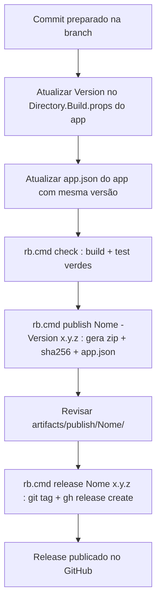

# Processo de release

Como publicar uma nova versão do **Launcher** ou de um **app** do catálogo Ribanense Soluções via GitHub Releases.

## Convenções

- **Tag**: `<slug>-v<semver>`. Exemplos: `launcher-v1.0.0`, `winget-v1.2.3`, `uwp-v0.1.0-beta.1`.
- **Nome do release**: `<PublicName> <Version>`. Exemplo: `Gestor WinGet 1.2.3`.
- **Branch-base**: `main` (ou a branch estável definida).
- **SemVer** 2.0, incluindo pre-releases (`-beta.1`, `-rc.2`).

## Fluxo recomendado

## Passo a passo

1. **Versão coerente**: atualizar `<Version>` no `csproj` (ou no `Directory.Build.props` do subprojeto) e o campo `version` no `app.json` do app.
2. **Validação local**: `rb.cmd check`.
3. **Publicação local**: `rb.cmd publish <Nome> -Version <x.y.z>`. Gera em `artifacts/publish/<Nome>/`:
   - `<nome>-<x.y.z>-win-x64.zip`
   - `<nome>-<x.y.z>-win-x64.zip.sha256`
   - `app.json`
4. **Release no GitHub**: `rb.cmd release <Nome> <x.y.z>`. Requer `gh auth status` OK.
5. **Atualização do `catalog.json`** (apenas na primeira versão de um app novo): editar `catalog/catalog.json` declarando `id`, `githubTagPrefix`, ícone, etc., e commitar.

## Formato dos assets

| Asset | Conteúdo |
|-------|----------|
| `<nome>-<ver>-win-x64.zip` | Resultado de `dotnet publish -c Release -r win-x64 --no-self-contained` do projeto do app. Depende do runtime compartilhado do Launcher. |
| `<nome>-<ver>-win-x64.zip.sha256` | `SHA256  <nome-do-arquivo>` em ASCII. |
| `app.json` | Cópia do manifesto para inspeção rápida via API do GitHub, sem baixar o zip. |

## Rollback

- Deletar o release no GitHub (`gh release delete <tag>`) e remover a tag (`git push --delete origin <tag>`).
- Se já havia usuários com a versão instalada, publicar uma versão corretiva (`x.y.z+1`) em vez de reescrever a tag.

## Assinatura de código (futuro)

- Sem certificado: SmartScreen pode alertar. Documentar na release note.
- Com certificado: `Set-AuthenticodeSignature` ou `signtool.exe` após `dotnet publish`, antes de compactar o zip.

## Rate limits

- API pública do GitHub sem auth: 60 req/h por IP. O Launcher cacheia agressivamente; ainda assim, para desenvolvimento local pesado, configure um token pessoal via variável de ambiente `GH_TOKEN`.

## Ver também

- [`ARQUITETURA.md`](ARQUITETURA.md)
- [`PLUGIN_SDK.md`](PLUGIN_SDK.md)
- [`FERRAMENTAS_CLI.md`](FERRAMENTAS_CLI.md)
