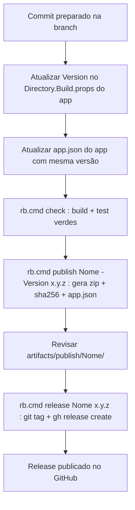

# Processo de release

Como publicar uma nova versão do **Launcher**, de um **app Windows**, do **OS**
RibanenseESP ou de um **app da placa** via GitHub Releases.

## Convenções

- **Tag**: `<slug>-v<semver>`. Exemplos: `launcher-v1.0.0`, `winget-v1.2.3`,
  `ribanense-esp-v0.0.3`, `esp-sobre-v0.1.0`.
- **Nome do release**: `<PublicName> <Version>`. Exemplo: `Gestor WinGet 1.2.3`.
- **Branch-base**: `main` (ou a branch estável definida).
- **SemVer** 2.0, incluindo pre-releases (`-beta.1`, `-rc.2`).

## Fluxo recomendado


```mermaid
flowchart TB
  A[Commit preparado na branch] --> B[Atualizar Version no Directory.Build.props do app]
  B --> C[Atualizar app.json do app com mesma versão]
  C --> D[rb.cmd check : build + test verdes]
  D --> E[rb.cmd publish Nome -Version x.y.z : gera zip + sha256 + app.json]
  E --> F[Revisar artifacts/publish/Nome/]
  F --> G[rb.cmd release Nome x.y.z : git tag + gh release create]
  G --> H[Release publicado no GitHub]
```

## Passo a passo

1. **Versão coerente**: atualizar `<Version>` no `csproj` (ou no `Directory.Build.props` do subprojeto) e o campo `version` no `app.json` do app.
2. **Validação local**: `rb.cmd check`.
3. **Publicação local**: `rb.cmd publish <Nome> -Version <x.y.z>`. Gera em `artifacts/publish/<Nome>/`:
   - `<nome>-<x.y.z>-win-x64.zip`
   - `<nome>-<x.y.z>-win-x64.zip.sha256`
   - `app.json`
4. **Release no GitHub**: `rb.cmd release <Nome> <x.y.z>`. Requer `gh auth status` OK.
5. **Atualização do `catalog.json`** (apenas na primeira versão de um app novo): editar `catalog/catalog.json` declarando `id`, `githubTagPrefix`, ícone, etc., e commitar.

## Fluxo automático para múltiplos apps (`publish all`)

Quando houver várias mudanças de apps e você quiser publicar em lote:

```bat
rb.cmd publish all --dry-run
rb.cmd publish all -Yes
```

O `publish all`:

1. Busca tags (`git fetch --tags`) e detecta **cada app Windows**, o **Launcher**,
   o **OS** (`ribanense-esp-v`) e os **apps da placa** (`esp-<slug>-v`) alterados
   desde a última tag do prefixo correspondente.
2. Calcula próxima versão com bump patch (`x.y.z -> x.y.(z+1)`).
3. Atualiza versões: `.csproj` + `app.json` (Windows); `Directory.Build.props`
   (Launcher); `ribanense_esp_version.h` + `firmware.json` (OS); `app.json` do
   app da placa.
4. Executa `rb.cmd check` **somente** se o plano tiver item .NET. IDF não entra
   no check.
5. Publica release no GitHub. No OS, preenche `url`/`sha256` em
   `firmware.json` (raw), troca o `.bin` em `dist/` (inclui o delete do
   anterior no mesmo commit) e faz push — a placa atualiza sozinha pelo GitHub.
   No app da placa, atualiza `catalog/esp-catalog.json`. O `publish all` **não**
   grava USB nem faz `POST /update` na LAN.

Observações:

- Use `--dry-run` para inspecionar o plano sem alterar arquivos.
- Por padrão há confirmação interativa; `-Yes` confirma automaticamente.
- O Launcher só entra no plano se mudou código do Launcher/SDK Windows,
  `catalog/catalog.json` ou `catalog/icons/`. Alterar `catalog/esp-catalog.json`
  (loja da placa) não republica o Launcher.
- Ponteiro pós-release (`firmware.json`, `firmware/ribanense-esp/dist/`) e o
  header de versão do OS no SDK não republicam OS/apps da placa sozinhos.
- Se o atualizador já gravado na placa não alcança o GitHub, a recuperação é
  `rb os flash COM8` (USB). O `rb` não faz isso sozinho.

## Formato dos assets

| Asset | Conteúdo |
|-------|----------|
| `<nome>-<ver>-win-x64.zip` | Apps do catálogo: `dotnet publish -c Release -r win-x64 --no-self-contained`. |
| `<nome>-<ver>-win-x64.zip.sha256` | `SHA256  <nome-do-arquivo>` em ASCII. |
| `launcher-<ver>-win-x64.exe` | Launcher: publish **self-contained + PublishSingleFile** (`win-x64`). Um único `.exe` para baixar e executar. |
| `launcher-<ver>-win-x64.exe.sha256` | `SHA256  <nome-do-arquivo>` em ASCII. |
| `app.json` | Cópia do manifesto do app (não se aplica ao Launcher nem ao OS). |
| `ribanense-esp-<ver>.bin` | OS da placa (IDF). |
| `ribanense-esp-<ver>.bin.sha256` | SHA256 do OS. |
| `esp-<slug>-<ver>.zip` | App da placa: `app.bin` + `app.json` (store, sem deflate). |
| `esp-<slug>-<ver>.zip.sha256` | SHA256 do zip da placa. |

## Rollback

- Deletar o release no GitHub (`gh release delete <tag>`) e remover a tag (`git push --delete origin <tag>`).
- Se já havia usuários com a versão instalada, publicar uma versão corretiva (`x.y.z+1`) em vez de reescrever a tag.

## Assinatura de código (futuro)

- Sem certificado: SmartScreen pode alertar. Documentar na release note.
- Com certificado: `Set-AuthenticodeSignature` ou `signtool.exe` após `dotnet publish`, antes de compactar o zip.

## Rate limits

- API pública do GitHub sem auth: 60 req/h por IP. O Launcher cacheia agressivamente; ainda assim, para desenvolvimento local pesado, configure um token pessoal via variável de ambiente `GH_TOKEN`.

## Ver também

- [`ARQUITETURA.md`](ARQUITETURA.md)
- [`PLUGIN_SDK.md`](PLUGIN_SDK.md)
- [`FERRAMENTAS_CLI.md`](FERRAMENTAS_CLI.md)
