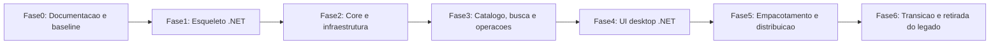

# Roadmap de migracao para .NET

Este documento descreve a estrategia da migracao completa (concluída) do BananaSuisa da base em PowerShell para uma stack .NET distribuivel.

## Objetivo

Migrar o produto sem perder comportamento critico, reduzindo:

- congelamentos e bloqueios na UI;
- concentracao excessiva de logica em poucos ficheiros;
- risco de regressao causado por script consolidado muito grande;
- dificuldade de testes, manutencao e empacotamento.

## Estado atual

Hoje o produto e composto por:

- fonte principal 100% C# .NET WPF (`src/`).
- App .exe com solicitação de UAC (`app.manifest`).
- integracao forte com `winget`, App Installer, downloads e dados locais em `BananaSuisa_recursos/`.

## Principios da migracao

- Migrar por etapas, e nao por reescrita cega.
- Preservar comportamento antes de modernizar UX.
- Extrair primeiro servicos e logica de dominio; UI vem depois.
- Formalizar decisoes em `docs/adr/`.
- Manter validacao real em Windows para fluxos com privilegios elevados.

## Visao geral das fases

## Fase 0 - Documentacao e baseline

**Objetivo:** preparar o terreno antes da primeira linha de codigo .NET.

**Entregaveis:**

- `docs/INDICE.md`
- `CONTRIBUTING.md`
- `docs/AMBIENTE.md`
- `AGENTS.md`
- `docs/REFERENCIAS_EXTERNAS.md`
- `docs/MAPEAMENTO_PS1_PARA_DOTNET.md`
- `docs/adr/`

**Criterio de saida:**

- a equipa sabe onde esta cada responsabilidade hoje;
- o processo de build e validacao do legado esta documentado;
- o formato de decisao arquitetural ja esta definido.

## Fase 1 - Esqueleto .NET

**Objetivo:** criar a base da solution e definir a stack final.

**Decisoes pendentes:**

- ADR-001: stack de UI (`WPF` vs `WinUI 3`);
- ADR-002: formato de distribuicao (`exe` self-contained vs framework-dependent; MSI com WiX);
- ADR-003: estrategia principal para integracao com `winget`.

**Entregaveis sugeridos:**

- solution .NET;
- projetos iniciais separados por responsabilidade;
- configuracao de build e convencoes de namespaces;
- first-run vazio mas compilavel.

**Criterio de saida:**

- solution compila localmente;
- estrutura de pastas e projetos foi aprovada;
- decisoes estruturais minimas foram registadas em ADR.

## Fase 2 - Core e infraestrutura

**Objetivo:** mover primeiro o que nao depende da UI final.

**Escopo principal:**

- resolucao de paths e raiz do projeto;
- configuracao e carregamento de JSON;
- log estruturado;
- versionamento;
- workspace e memoria local;
- deteccao de `winget`, App Installer e pre-requisitos;
- servicos de processo, ficheiro, HTTP e shell.

**Origem principal no legado:**

- `nucleo/bootstrap.ps1`
- `nucleo/versao.ps1`
- partes de `funcionalidades/catalog.ps1`
- partes de `funcionalidades/actions.ps1`

**Criterio de saida:**

- o core .NET consegue ler config, preparar workspace e diagnosticar runtime sem depender da UI;
- testes automatizados ja cobrem a maior parte da logica pura.

## Fase 3 - Catalogo, busca e operacoes

**Objetivo:** migrar servicos de negocio antes do wiring visual.

**Escopo principal:**

- leitura e normalizacao do catalogo;
- busca local e fuzzy search;
- listagem de apps instaladas e upgrades;
- downloads auxiliares;
- manutencao de cache e reparo do `winget`;
- operacoes de instalacao, atualizacao e remocao;
- fluxos de drivers e updates do Windows.

**Origem principal no legado:**

- `funcionalidades/search.ps1`
- `funcionalidades/catalog.ps1`
- `funcionalidades/actions.ps1`
- partes de `interface/views.ps1`

**Criterio de saida:**

- servicos .NET podem ser executados sem UI;
- operacoes criticas retornam resultados estruturados em vez de depender de controles WinForms.

## Fase 4 - UI desktop .NET

**Objetivo:** reconstruir a interface sobre servicos ja migrados.

**Escopo principal:**

- janela principal;
- layout, navegacao lateral e cabecalho;
- area de logs e relatorio;
- binding de estado e comandos;
- fluxos de modos (instalar, atualizar, remover, sistema, impressoras e outros).

**Origem principal no legado:**

- `interface/theme.ps1`
- `interface/layout.ps1`
- `interface/views.ps1`
- `eventos/app.events.ps1`

**Criterio de saida:**

- a UI .NET cobre os fluxos principais do produto;
- operacoes longas nao bloqueiam a thread de interface;
- estados e erros sao apresentados sem a estrutura atual de handlers acoplados.

## Fase 5 - Empacotamento e distribuicao

**Objetivo:** entregar binarios consistentes para uso interno ou distribuicao.

**Escopo principal:**

- publicacao de `.exe`;
- instalador `.msi`;
- atalhos, versao, icones e metadata;
- estrategia de atualizacao e desinstalacao;
- documentacao de instalacao e rollback.

**Ferramentas previstas:**

- `dotnet publish`
- WiX Toolset

**Criterio de saida:**

- existe um fluxo documentado e repetivel para gerar artefatos;
- a instalacao nao depende do `ps1` consolidado.

## Fase 6 - Transicao e retirada do legado

**Objetivo:** reduzir dependencia do runtime antigo sem perder capacidade operacional.

**Escopo principal:**

- comparacao de paridade entre PS1 e .NET;
- periodo de coexistencia controlada;
- congelamento do legado para correcoes essenciais;
- retirada gradual do consolidado quando a nova app atingir cobertura suficiente.

**Criterio de saida:**

- os fluxos essenciais foram validados na nova stack;
- o legado deixa de ser a implementacao principal.

## Riscos principais

- integracao com `winget` e App Installer ter comportamento diferente entre runtime atual e nova stack;
- fluxos de update, drivers e reparo exigirem testes reais com elevacao;
- misturar migracao tecnica com redesign completo da UX;
- tentar portar `views.ps1` diretamente sem antes separar servicos e estado.

## Regras para a implementacao

- Nao recriar o script consolidado em C#; recriar responsabilidades em servicos e camadas claras.
- Evitar portar handlers WinForms como bloco unico.
- Registrar decisoes estruturais em ADR antes de consolidar a direcao tecnica.
- Atualizar este roadmap quando uma fase mudar de escopo ou criterio de saida.

## Documentos relacionados

- [`MAPEAMENTO_PS1_PARA_DOTNET.md`](MAPEAMENTO_PS1_PARA_DOTNET.md)
- [`../BananaSuisa_desenvolvimento/docs/ARQUITETURA.md`](../BananaSuisa_desenvolvimento/docs/ARQUITETURA.md)
- [`adr/README.md`](adr/README.md)
